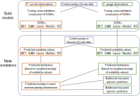

# Swallowtail Climate Change
Data and code for North American Swallowtail and larval host plant 
distributions in relation to climate change

**Currently under development**

## General approach:

Retrieves data from online sources (in this case, the Global Biodiversity 
Information Facility, [GBIF](https://gbif.org)) and perform quality control 
processes to ensure observations are only from Canada, Mexico, and the United 
States of America. The data are analyzed to create species distribution models 
based on presence and pseudo-absence data using a variety of models (e.g. 
Maximum Entropy, generalized linear model). The models are then used to predict 
presence or absence under a variety of conditions, including current climate 
and forecast climate models. These predictions are used to estimate change in 
the range sizes of individual butterfly species and the relative size of range 
overlap of their known host plant species. Finally, these predictions are 
combined with land use data to assess the importance of protected areas for
maintaining suitable habitat for _Papilio_ species.

## Dependencies

The project uses the following additional R packages:

+ cowplot
+ dismo
+ dplyr
+ ecospat
+ ENMeval
+ exactextractr
+ fitMaxnet
+ flexsdm
+ gbm
+ ggplot2
+ glmnet
+ gridExtra
+ ks
+ Matrix (for lasso models)
+ mgcv
+ parallel (usually part of R distribution, but needs explicit loading)
+ predicts
+ randomForest
+ raster
+ rnaturalearth
+ rnaturalearthdata
+ rnaturalearthhires
+ Rtools (needed to use the zip() function on Windows machines)
+ sf
+ spocc
+ stringr
+ terra
+ tidyr
+ tidyterra
+ TNRS

Data to support much of the rnaturalearth package functionality are stored in 
two data packages that should be installed using the following:
devtools::install_github("ropensci/rnaturalearthdata")  
devtools::install_github("ropensci/rnaturalearthhires")

## Workflow

The workflow has the general structure of:

1. Data retrieval and cleaning
2. Bulk processing of single-species analyses; for each species distribution 
method (boosted regression trees (BRT), generalized additive model (GAM), 
lasso, maximum entropy (MaxEnt), and random forest (RF)):
    1. Evaluate models using spatial cross validation (CV)
    2. Using best models from CV step, above, re-estimate model parameters 
    using all observational data (no training/testing split)
    3. Predict suitability values for each species, for each of five climate 
    models (one contemporary, four forecast); combine these for an ensemble 
    suitability raster and presence/absence prediction 
    4. Combine predicted consensus distributions of each _insect_ species with 
    the consensus predictions for all of its respective host plants to create a 
    single raster with distributional information (see documentation in 
    functions/overlap_raster.R for interpretations of values in those rasters)
3. Synthesizing results of single-species analyses
4. Comparing areas of suitable habitat to areas that are categorized as 
[protected by the IUCN](http://www.cec.org/north-american-environmental-atlas/north-american-protected-areas-2021/).

### Scripts, in order of use

Descriptions below are limited to scripts that are part of the analysis 
workflow, including data retrieval and preparation. It does not includes some 
scripts that are used for quality control purposes (e.g.
src/data/count-gbif-names.R).

1. **src/data** Data retrieval and cleaning. Observational data (from GBIF) 
files for individual species are not under version control, but zip archives of 
those files _are_ under version control. For example, individual species files 
downloaded in step 1 are stored in data/gbif/downloaded, the contents of which 
are ignored. However, all those files are compressed into the zip archive 
data/gbif-downloaded.zip, which _is_ under version control.
   1. **src/data/gbif-1-download.R**: Download observational data from GBIF to 
   the data folder; compressed data are stored in data/gbif-downloaded.zip.
   2. **src/data/gbif-2-filter.R**: Run quality assurance on downloaded data, 
   and retain only those records that:
       1. are not observations based on barcodes only,
       2. are observations from 2000-2024,
       3. are in locations with climate data (which effectively restricts 
       observations to North America), and
       4. are thinned to a max of 1 observation per grid cell (of climate 
       raster),
       5. are inside the 98% contour of observations
   compressed data are stored in data/gbif-filtered.zip.
   3. **src/data/gbif-3-presence-absence.R**: Generate a presence/absence 
   dataset for each species, to be used in any species distribution model; 
   also create a shapefile defining geographical limits of predictions. 
   Compressed presence/absence data are stored in data/gbif-pa.zip and 
   shapefiles for individual species are stored in data/gbif-shapefiles.zip.
   5. **src/data/prep-climate-data.R**: Download monthly climate data for time 
   span of interest (2000-2018) and calculate the average values for the 19 
   standard bioclimatic variables (should not need to be run locally; data are 
   available in data/wc2-1 directory); resulting rasters are in 2.5 minute 
   resolution.
   6. **src/data/prep-forecast-data.R**: Download monthly climate data for 
   ensemble of forecast climate models and calculate the average values for the 
   19 standard bioclimatic variables (should not need to be run locally; data 
   are available in data/ensemble sub-directories); resulting rasters are in 
   2.5 minute resolution.
   7. **src/data/protected-areas-management.R**: Categorize all polygons in 
   IUCN protected area shapefile into four management types (National, State, 
   Local, Private); resulting shapefile too large for GitHub, so currently 
   stored on Google Drive.
2. **src/run-analyses** Bulk processing of single-species analyses (see below 
for example graphic). These are designed to run all species' analyses in 
parallel, so they should not be run locally (i.e. on a desktop or laptop 
computer) or executed directly, but rather they should be called by a job 
manager on an HPC (see next set of steps).
   1. **src/run-analyses/run-all-1-CV.R**: Run model evaluation for individual
   species; can toggle on/off to run all species or just a subset. Output 
   includes full data estimation for MaxEnt method.
   2. **src/run-analyses/run-all-2-SDMs-full.R**: Estimate SDMs on full data set 
   for individual species' (for BRT, GAM, Lasso, and RF methods); can toggle 
   on/off to run all species or just a subset.
   3. **src/run-analyses/run-all-3-predict.R**: Predict suitabilities and 
   distributions (presence/absence rasters) for individual species (for BRT, 
   GAM, Lasso, MaxEnt, and RF methods); can toggle on/off to run all species or 
   just a subset.
3. **src/hpc** Running analyses on HPC (running the scripts of step 2, above, 
on a high-performance computing cluster). Also includes development scripts 
("test-" to test execution of slurm scripts on a few species), cluster 
preparation scripts ("prep-" including installation of required R packages and 
data extraction from zip archives), and transfer of analyses output to OneDrive
(transfer-predictions.slurm). It is recommended that the three "run-all-[d]-"
scripts are run **serially** to ensure that inputs for each step are available 
(i.e. don't run step 2 until all the output from step 1 are available).
   1. **src/hpc/run-all-1-CV.slurm**: Run the R script 
   src/run-indiv/run-all-1-CV.R via slurm
   2. **src/hpc/run-all-2-SDMs-full.slurm**: Run the R script 
   src/run-indiv/run-all-2-SDMs-full.R via slurm
   3. **src/hpc/run-all-3-predict.slurm**: Run the R script 
   src/run-indiv/run-all-3-predict.R via slurm
4. **src/summary** Synthesizing results of single-species analyses
   1. **src/summary/summary-1-create-overlap-rasters.R**: Create predicted 
   overlap rasters for each species of insect; see details of raster cell 
   values in the script. Will also create maps (ggplot-produced png files) if 
   indicated.
   2. **src/summary/summary-2-compare-ranges.R**: Compare the ranges of current 
   to forecast distributions, both considering insect ranges alone, and 
   considering only the areas where insects are predicted to overlap with one 
   or more host plant species; several metrics calculated, including area and 
   median latitude. Also create raster of predicted differences in range 
   between contemporary climate and forecast climate models and create maps 
   (in png format) if indicated.
   3. **src/summary/summary-3-draw-species-richness-maps.R**: Draw maps of 
   _Papilio_ species richness for current and forecast climate conditions and a 
   map showing the change between current and forecast estimates.
   4. **src/protected-areas-1-calc-species.R**: Calculate proportion of 
   species' distributions that are in protected areas.
   5. **src/protected-areas-2-calc-hotspots.R**: Calculate proportion of areas
   with high swallowtail species richness that are protected.
   6. **src/protected-areas-3-plot-species.R**: Create plot of area (sq km) and 
   proportion of individual species' suitable range that is on land with some 
   form of protection.
   7. **src/protected-areas-4-plot-hotspots.R**: Create plot of area (sq km) 
   and proportion of areas deemed "hotspots" (currently areas with >= 4 
   _Papilio_ species) that is on land with some form of protection.
   8. **src/summary/create-delta-maps.R**: DEPRECATED Create maps (graphics 
   files) showing changes in areas predicted as suitable between time periods.
   9. **src/summary/create-manuscript-objects.R**: DEPRECATED Prepare figures 
   and tables for manuscript.
   10. **src/summary/create-observations-maps.R**: DEPRECATED Create graphics 
   files (png) of filtered observations on a map.
   11. **src/summary/create-supplement-objects.R**: DEPRECATED Prepare 
   supplemental figures and tables for manuscript.
4. **src/manuscript** Prepare figures and tables for manuscript
   1. **src/manuscript/figs-2-shifts.R**: Figures for longitudinal and 
   latitudinal shifts in suitable areas.
   2. **src/manuscript/figs-3-richness.R**: Figures for species richness based 
   on suitable areas for insects that overlap with areas suitable for at least 
   one host plant species.
   3. **src/manuscript/figs-4-distributions.R**: Figures of suitable areas; 
   includes predictions for contemporary and forecast climate conditions. Also 
   creates delta maps which show difference between contemporary climate 
   predictions and those of forecast climate conditions.
   4. **src/manuscript/figs-5-protected.R**: Figures for amount and proportion 
   of richness hotspots (based on suitable areas) that lie within protected 
   areas.
   5. **src/manuscript/render-cheatsheet.R**: Assemble majority of figures 
   (main and supplemental) into a single reference pdf.
   6. **src/manuscript/tables-1-species.R**: Table (in CSV format) with summary 
   stats for each species.
   1. **src/manuscript/tables-2-overlap.R**: Table of predicted suitability 
   areas and overlap with areas suitable for at least one host species.

### Analysis workflow example
Analysis workflow with _Papilio rumiko_ and one of its host plants, 
_Casimiroa greggii_, from bulk processing of single-species analyses (step 3, 
above).

## Directory structure

+ data
    + ensemble: forecast climate data
    + gbif: observation data; most data are under version control in zip files
    starting with the string "gbif-". Individual csv files are not under 
    version control.
        + downloaded: data downloaded from GBIF; no QA/QC or filtering
        + filtered: filtered observation data (see src/data/gbif-2-filter.R)
        + presence-absence: observation data with presence and pseudo-absences
        + shapefiles: minimum convex polygons based on filtered observations
    + lakes: North American large bodies of water shapefiles; used to exclude 
    climate data from such areas (see src/data/prep-climate-data.R)
    + political-boundaries: shapefiles of political boundaries for drawing maps
    + protected-areas-management: categorization of protected areas into 
    four categories: National, State, Local, and Private
    + wc2-1: current (contemporary) climate data
+ development: directory for script development
    + data: data for developmental purposes
    + functions: R functions under development
    + output: destination folders for output from developmental scripts/
    functions; generally files are not under version control, although 
    directory structure is.
        + SDMs: model objects from species distribution modeling
        + distributions: predicted distributions based on species distribution 
        models (from SDMs folder) and climate data (either current or forecast)
    + src: R scripts under development
+ docs: additional detailed documentation
+ functions: R functions used by the project
+ logs: Log files from parallel processing of modeling and forecasting steps 
(files with .log extension are not under version control)
+ output: most files are not under version control, but directory structure is
    + areas: estimated areas and changes from contemporary distributions
    + deltas: rasters comparing predicted contemporary distributions to 
    predictions for the four forecast climate scenarios
    + distributions: raster files of predicted distributions for individual 
    species; ensemble predictions based on five SDM methods
    + eval-metrics: evaluation metrics for individual species distribution 
    models and tuning parameters (where appropriate) for each species
    + manuscript: summary statistics and manuscript figures; most files in this 
    directory _are_ under version control
    + maps: distribution maps (image files) for insect species and hosts and 
    predicted changes in distributions under four forecast climate scenarios
    + overlaps: composite rasters of insect and host species
    + plots: miscellaneous data visualizations
    + richness: species richness rasters and maps (see 
    src/summary/summary-3-draw-species-richness-maps.R)
    + SDMs: best-fit species distribution models for five SDM methods
    + suitabilities: predicted suitability values
    + summary-stats: summary statistics from model performances
+ src: 
    + bash: a fairly brute force approach for identifying R package 
    dependencies (find-dependencies.sh)
    + data: R scripts for data download, assessment, and quality control
    + hpc: scripts (primarily slurm) for running analyses on HPC
    + manuscript: scripts preparing figures and tables for manuscript
    + run-analyses: R scripts to run individual species analyses in parallel
    + summary: R scripts to analyze and visualize results of individual species
    modeling and predictions
+ templates: quarto templates for assembling multi-page PDFs of figures
+ tests: woefully depauperate location for tests

## Miscellany

+ load_functions.R is a helper script that loads all the functions in the 
functions directory with the `source()` command

## Additional resources

+ Excellent set of examples and underlying rationale of species distribution 
modeling in R: [https://rspatial.org/raster/sdm/index.html](https://rspatial.org/raster/sdm/index.html)
+ Performance comparisons among several species distribution modeling methods: 
Valavi et al. 2021, [https://doi.org/10.1002/ecm.1486](https://doi.org/10.1002/ecm.1486).
+ Another comparison among different SDM approaches at
[https://doi.org/10.1002/ecm.1370](https://doi.org/10.1002/ecm.1370)
+ Good best practices that we should probably adopt at  [https://cran.r-project.org/web/packages/rangeModelMetadata/vignettes/rmm_workflowWithExampleRangeModel.html](https://cran.r-project.org/web/packages/rangeModelMetadata/vignettes/rmm_workflowWithExampleRangeModel.html)
+ Heh heh, just look: [https://doi.org/10.1111/2041-210X.13591](https://doi.org/10.1111/2041-210X.13591)
+ Worked example of species distribution models used to inform decision-making
[https://doi.org/10.1093/biosci/biz045](https://doi.org/10.1093/biosci/biz045)
