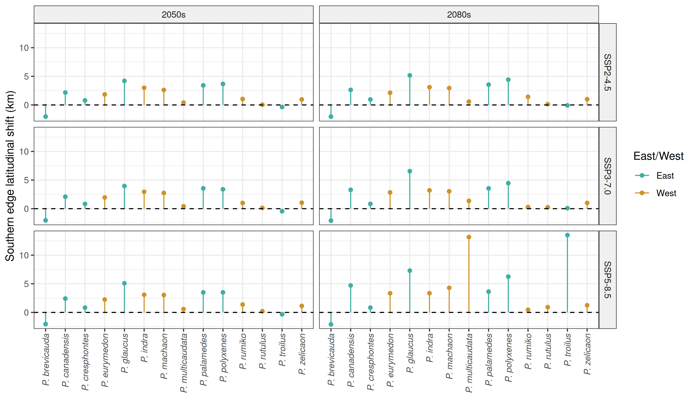
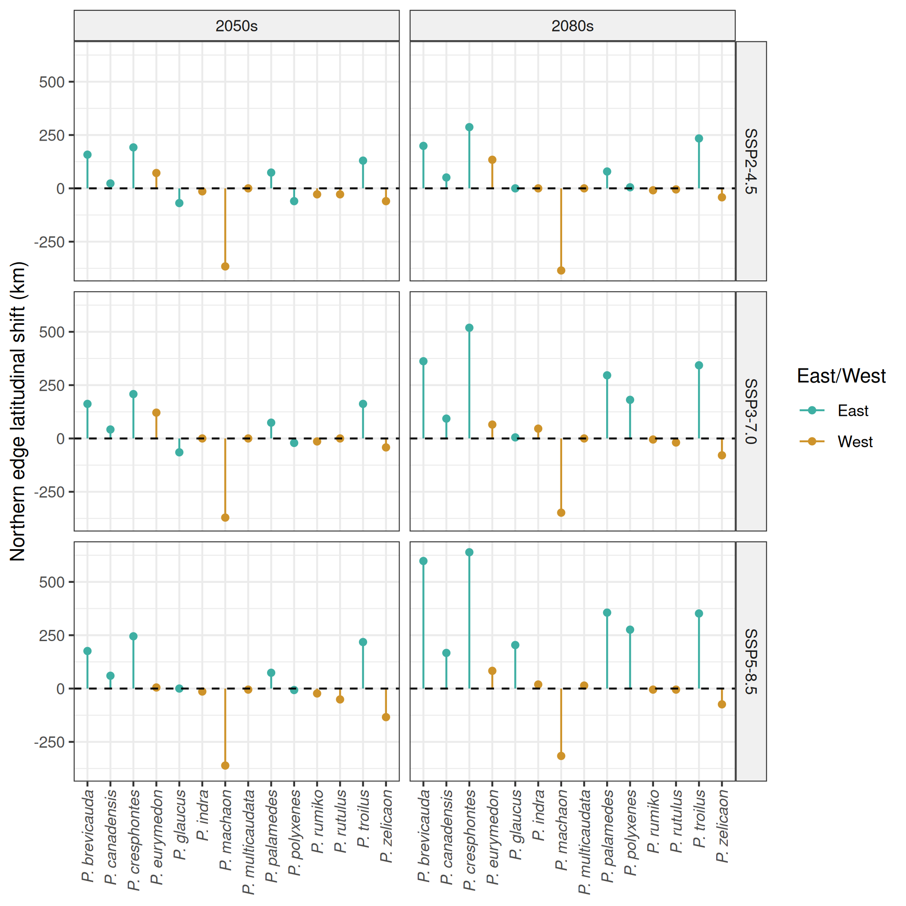
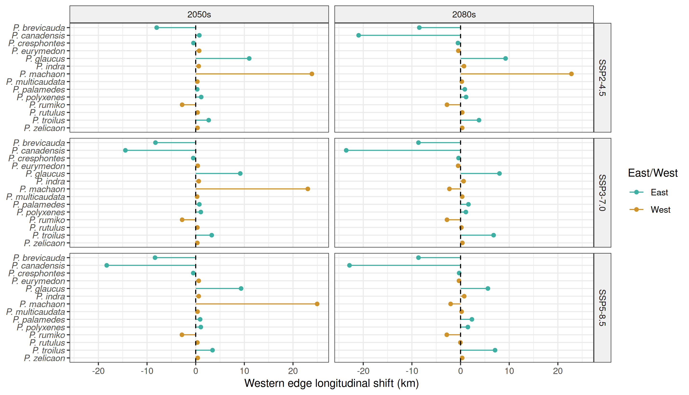
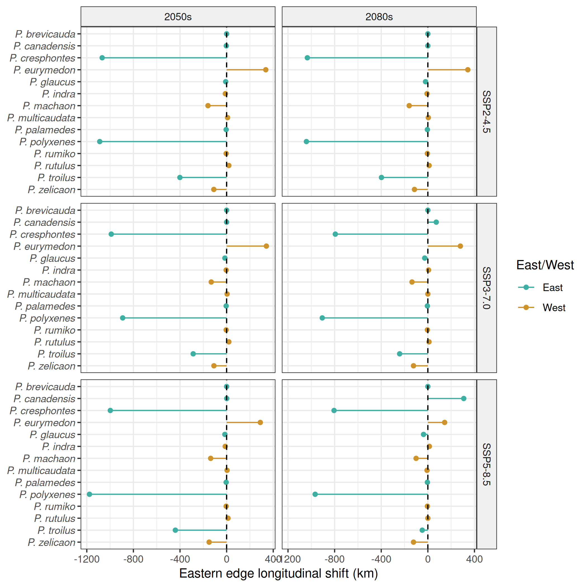

Document includes old figures looking at differences in shifts between eastern 
and western species.

::: {#fig-s-shift-south fig-pos="H"}

**Shifts in southern edge of predicted suitable areas.** Change in kilometers 
(relative to contemporary predictions) in the median southern latitude of areas 
predicted as suitable for each *Papilio* species and at least one host plant 
species under three SSPs and two time points. Points above the horizontal 
dashed line indicate range contractions northward and points below the 
horizontal dashed line indicate range expansions southward.
:::



::: {#fig-s-shift-north fig-pos="H"}

**Shifts in northern edge of predicted suitable areas.** Change in kilometers 
(relative to contemporary predictions) in the median northern latitude of areas 
predicted as suitable for each *Papilio* species and at least one host plant 
species under three SSPs and two time points. Points above the horizontal 
dashed line indicate range expansions northward and points below the 
horizontal dashed line indicate range contractions southward.
:::



::: {#fig-s-shift-west fig-pos="H"}

**Shifts in western edge of predicted suitable areas.** Change in kilometers 
(relative to contemporary predictions) in the median western longitude of areas 
predicted as suitable for each *Papilio* species and at least one host plant 
species under three SSPs and two time points. Points left of the horizontal 
dashed line indicate range expansions westward and points right of the 
horizontal dashed line indicate range contractions eastward.
:::



::: {#fig-s-shift-east fig-pos="H"}

**Shifts in eastern edge of predicted suitable areas.** Change in kilometers 
(relative to contemporary predictions) in the median eastern longitude of areas 
predicted as suitable for each *Papilio* species and at least one host plant 
species under three SSPs and two time points. Points left of the horizontal 
dashed line indicate range contractions westward and points right of the 
horizontal dashed line indicate range expansions eastward.

:::